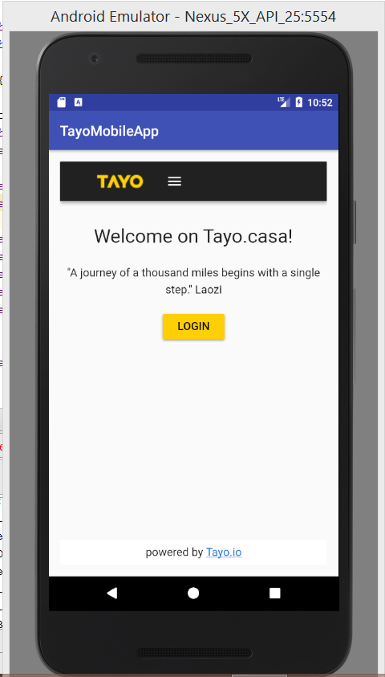
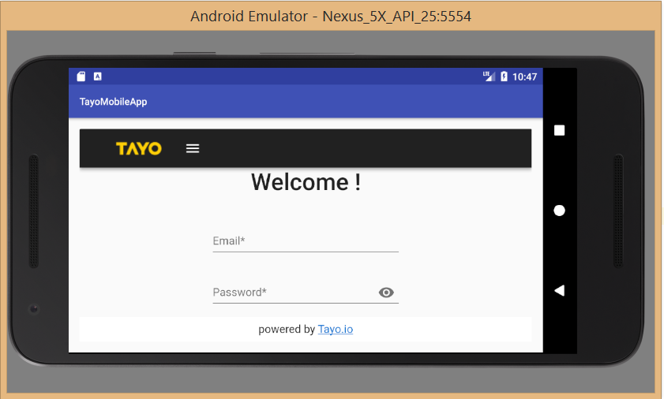
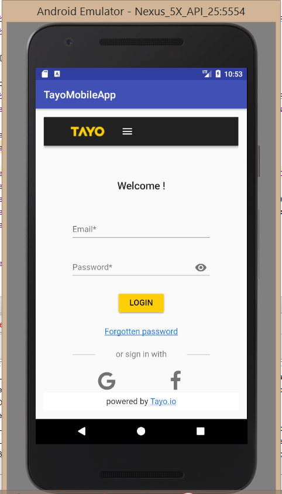

# Tayo Mobile web app using android WebView

### Technology used
To render the webpage faster with heavy resources I have used Advance android webview
and also handled the screen orientation(Portait and landscape) 

### Application ScreenShot

Portrait Mode

Landscape Mode

Login Page

